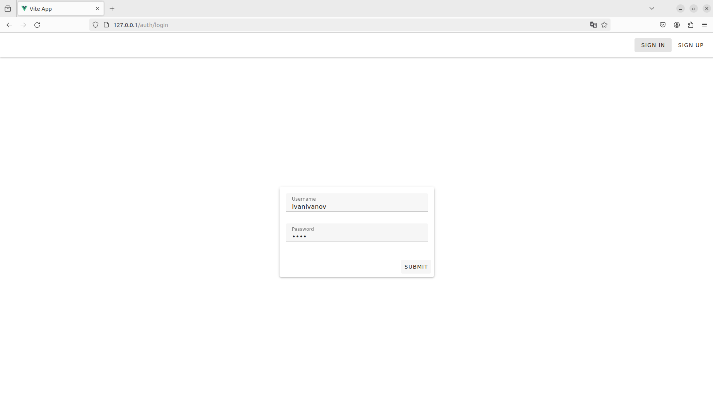
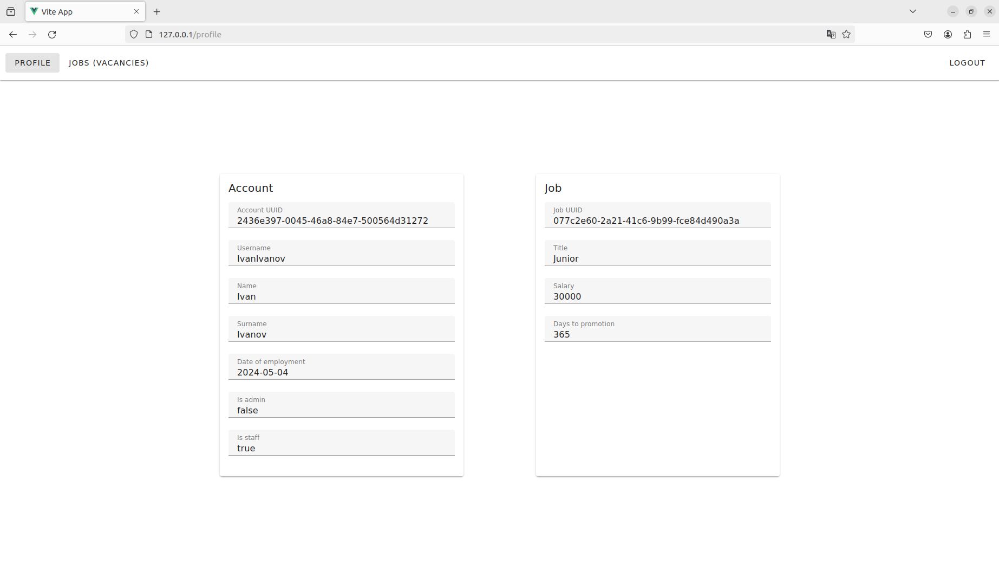
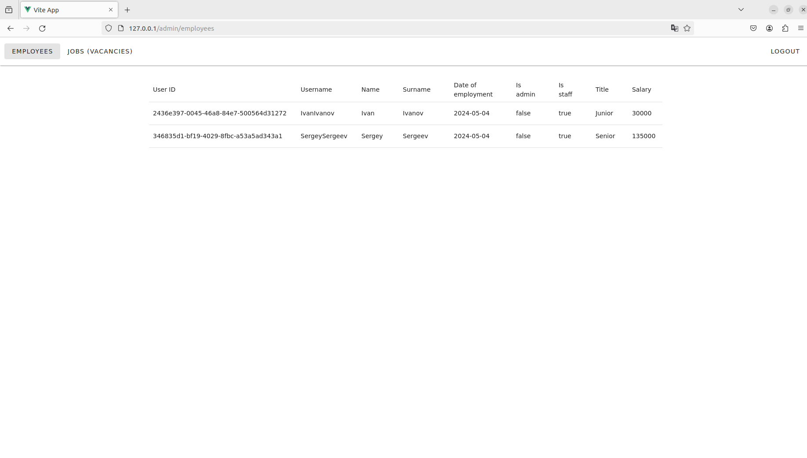

## Preview

This application provides personal information to registered users. To view account information, the user need
*Login* or *Register*.

<picture>
  
</picture>

After authentication success, the user will see the personal account information.

<picture>
  
</picture>

The administration functionality as also available. The Admin can show extended informations
aboutn users.

<picture>
  
</picture>


## Installation

1) Clone this repository:

```bash
git clone https://github.com/PavelKrivorotov/task_25_04_2024.git
```

## Usage

1) Run containers in work directory:
  
  ```bash
  docker compose up
  ```

2) Open this url adress in browser (Frontend):

 ```bash
 http://127.0.0.1:80
 ```

3) Open this url, if you want show API (Backend)

```bash
http://127.0.0.1:8000/docs
```

## Default

This following settings are available by default
1) Jobs
   - Junior
     - id: **077c2e60-2a21-41c6-9b99-fce84d490a3a**
   - Middle
     - id: **acd00cd4-f548-4804-bbe2-31a72adebd78**
   - Senior
     - id: **815b87e7-cc34-45dc-b520-38bc32372962**
3) Admins
   - username: **admin**
   - password: **admin**
